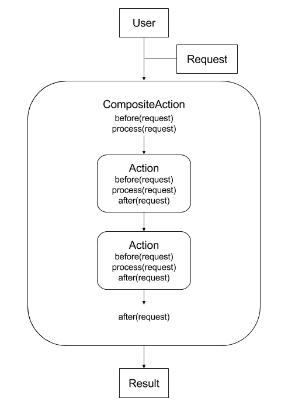

.. _actions:

==============
istsos.actions
==============

With istSOS every process is made by an actions chain. Following the Chain of
Responsibility Design Pattern when a client execute a request a single Action
or a chain of Actions is executed. The request is an entity, which means
that is simply a python dictionary. This object contains the configurations
needed to complete the processing bubt also the results. Some actions can
generate the input for the next action and so on.

In addition to the pattern istSOS add the possibility to implement before and
after processing in a predefined sequence:

That can be useful when extending some actions overwriting only some part of
the process like in the case of data retreival from different databases.

***************************
sos_2_0_0.getCapabilitiesOp
***************************
