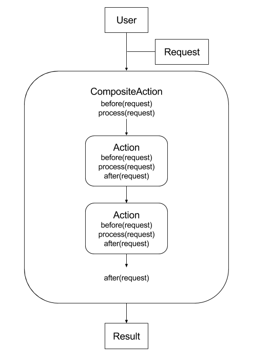

.. _architecture:

============
Architecture
============

With istSOS every process is made by an actions chain. Following the Chain of
Responsibility Design Pattern concept when a client execute a request a single
Action or a chain of Actions is executed. The request is the input entity (see
:ref:`entities`, an entity is a python dict). The request object contains the
configurations needed to complete the processing but also the results.
Some actions can generate the input for the next action and so on.

In addition to the pattern istSOS add the possibility to implement before and
after processing sequentially:

That can be useful when extending some actions overwriting only some part of
the process like in the case of data retrieval from different databases.

The core components of the istSOS architecture are: entities and actions.

********
Entities
********

**Entities** are the data containers. Each entity class is an extesion of the
dictionary class. So it behaves as a dict. Each Entity shall implement a JSON
schema that will be used when initializing it.

see :ref:`entities` for more information.

*******
Actions
*******

**Actions** can be identified as single processing units, where each action is
specialized in a specific task. For instance the **uoms action retriever** is
able uniquely to load all the Uoms data entities.

Actions are splitted into four cathegories:

 - builders
 - creators
 - retrievers
 - servers

see :ref:`actions` for more information.
