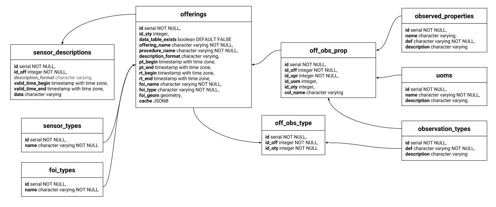
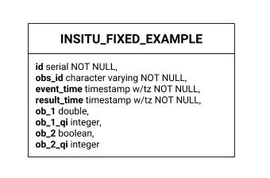
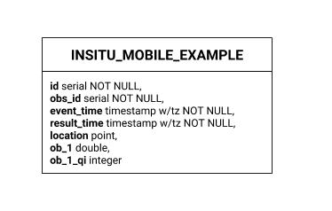
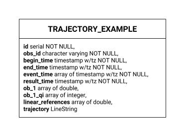
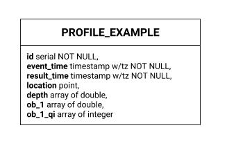
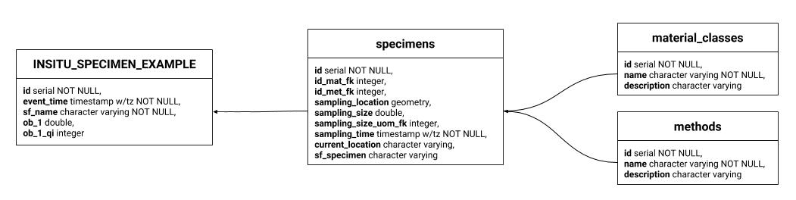

.. _db-postgres:

========
Postgres
========

Here the entity relationship representation of the PostgreSQL implementation.

*****************
Default workspace
*****************

-------------------
InsertSensor tables
-------------------

As soon an *insertSensor* request is done, istSOS stores into the followings
table the data:

 - offerings
 - off_obs_type
 - off_obs_prop

Depending on the :ref:`systemtypes` a basic table with default columns that will
contain the measurements is also created into the schema named as "data".

Considering that during an *insertSensor* request there is not an explicit
declaration between observableProperty and and the observationType, the
relation will be stored during the first *insertObservation* request.

In particular, during an *insertObsevation* request, the relation between the
observation_types and uoms table and the **off_obs_prop** will be set. During this
operation also in the *data table* will be added the corresponding columns
in accordance to the relation of the **off_obs_prop** table.

***************
Data containers
***************

Each :ref:`systemtypes` is implemented diffently to satisfy particular
requirements related to the System Type.

----------------------------
Point TimeSeries Observation
----------------------------

Point TimeSeries Observation table structure is the simplest and most common
(ex: Meteo Station). The feature of interest is stored inside the offerings
table (offerings.foi_geom).

-----------------------------
Mobile TimeSeries Observation
-----------------------------

Mobile TimeSeries Observation table structure looks like the Point TimeSeries
Observation, but in addition in the data table the actual position is stored
together with measurements (ex: Formula 1 car sending real-time data from
sensors at different location and time).

----------------------
Trajectory Observation
----------------------

The trajectory observation is an O&M pattern where the time series of data is
sent together with a `SF_SamplingCurve
<http://www.opengis.net/def/samplingFeatureType/OGC-OM/2.0/SF_SamplingCurve>`_
feature of interest representing the trajectory in which the measurements has
been done at a certain distance from the beginning.

.. note::

    The benefit of linear referencing models is that the dependent spatial
    observations do not need to be separately recorded from the base
    observations, and updates to the base observation layer can be carried
    out knowing that the dependent observations will automatically track the
    new geometry (src `Introduction to PostGIS
    <http://workshops.boundlessgeo.com/postgis-intro/linear_referencing.html>`_).

-------------------
Profile Observation
-------------------

The profile observation O&M pattern is from the same family of the trajectory
observations.The time series of data is sent together with a `SF_SamplingCurve
<http://www.opengis.net/def/samplingFeatureType/OGC-OM/2.0/SF_SamplingCurve>`_
feature of interest representing the profile in which the measurements has
been done.

--------------------
Specimen Observation
--------------------

The specimen observation O&M pattern differs from others because the feature of
interest is a physical sample taken off at specific location. The data are sent
with a reference to the specimen. The specimen is inserted previously.

