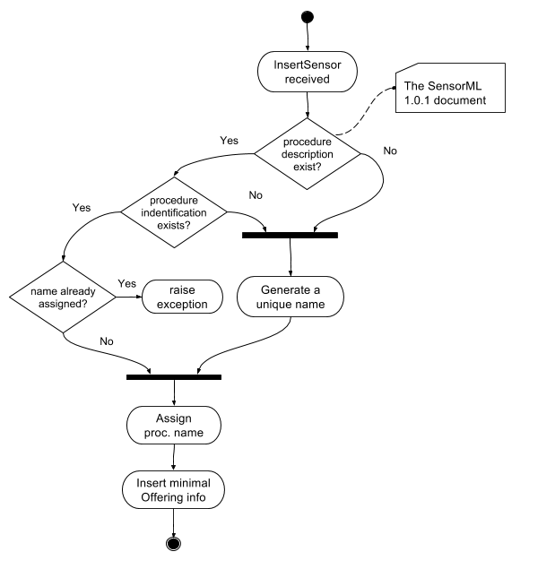

.. _insertsensor:

============================
Registration of new sensors
============================

With regards to the OGC SOS 2.0.0 Transactional Extension istSOS supports the
insertSensor request.
The database will be created on the go. During an InsertSensor the minimal
info will be stored. Later when the InsertObservation will be done, the
rest of the data store will be built.

**Offering name**

.. note::

    According to the OGC SWES [OGC 09-001] on each InsertSensor request a new
    Offering shall be created (OGC 09-001, REQ 49). IstSOS will generate a
    unique identifier.

**Procedure name**

The procedure name can be assigned to a new sensor by setting the
identifier (uniqueID) in the SensorML of the procedureDescription.

.. note::

    According to the OGC SWES [OGC 09-001], on each InsertSensor request istSOS
    will assign an auto generated name if a procedure identifier is not defined
    within the SensorML (OGC 09-001, REQ 50).

**Observed properties**

.. note::

    The outputs defined within the SensorML are not used to initialize the
    new offerings. According to the OGC SensorML Implementation Specification
    [OGC 07-000], SensorML is not intended to provide the framework for
    encoding the actual observation values. Within the SWE framework, the
    actual observation results should be encoded and transmitted within an
    O&M Observation instance or as a TML data stream. (OGC 07-000, 8.12.2).

**Flow chart**

**Examples**

Here an example on how manually register a new sensor using Python 3.

.. code-block:: python3

    import asyncio
    from istsos.application import Server
    from istsos.entity.httpRequest import HttpRequest
    from istsos.actions.sos_2_0_0.insertSensorOp import InsertSensor

    @asyncio.coroutine
    def execute():
        with open('examples/xml/insertSensor-1.xml') as xml_file:

            # Installation of the istSOS server
            server = yield from Server.create()

            # Preparing the Request object
            request = HttpRequest(
                "POST",
                "sos",
                body=xml_file.read(),
                content_type="application/xml"
            )

            response = yield from server.execute_http_request(
                request, stats=True
            )

    loop = asyncio.get_event_loop()
    loop.run_until_complete(
       asyncio.gather(execute())
    )
    loop.close()
